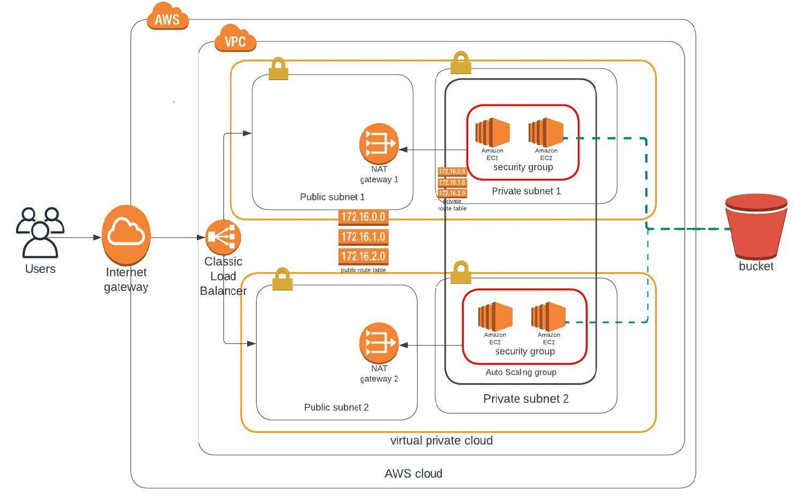

# UDAGRAM AWS INFRASTRUCTURE.
  This is A Cloud Infrastructure Project that implements `Infrastructure As Code` using AWS CloudFormation Service to build both `Networking` and `Server` Infrastructures for `Udagram`, a Software Company. First, a High Availability Network Structure is Created, then servers are Created to Serve Web Applications.

  ## Documentation
  Following is the Project Documentation.
  
  ### Infrastructure Diagram
  Below is the `AWS CloudFormation` Diagram.
  

  In the Infrastructure Diagram above, We have an `AWS VPC` that spans two AZs (Availability Zones), in each of these AZs is a Pair of `Private` and `Public` Subnet, Behind the `Private` Subnets are two Servers making a total of Four (4) that make up The `AutoScaling Group`.

  
  ### Usage.
  There are four (4) bash scripts specifically written to serve as helper with interracting with the `AWS` Command Line namely
  * create.sh
  * update.sh
  * describe.sh
  * delete.sh

  There are few defaults set specifically for the above listed 4 scripts
*For the Network Infrastructure*: 'The `stack-name` must contain the word `network` to use the default (e.g, `./create.sh udagram-network`)
  - template-file: `network.yaml`
  - parameter: `network-parameters.json`
  
*For the Servers Infrastructure*: The `stack-name` must contain the word `server` to use the default (e.g, `./create.sh udagram-servers`)
  - template-file: `final-project-starter.yaml`
  - parameter: `server-parameters.json`
